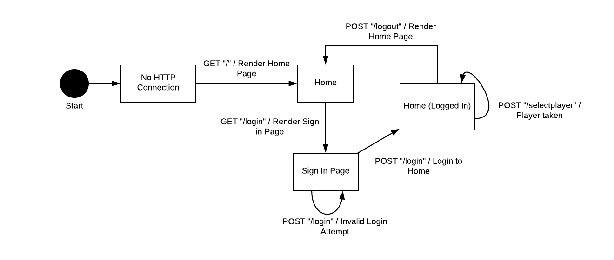

# PROJECT Design Documentation

# Team Information
* Team name: CrispyCantaloupes
* Team members
  * Hongda Lin (HL)
  * Gaurav Pant (GP)
  * Eugene Chang (EC)
  * Emily Wesson (EW)
  * Karthik Iyer (KI)

## Executive Summary
This project is a multi-player, online web application to play the game of checkers. The application’s PlayerLobby allows players to log-in and matches them with an opponent if another player selected them. Once in the game, players take turns moving pieces with the goal to capture opponent pieces and upgrade their own pieces. The game ends when a player resigns, or takes all of their opponent’s pieces.

### Purpose
This checkers application follows American rules of play, and allows the first player to choose their opponent. The most important user group is checkers enthusiasts who want to play a game online without meeting in person with an opponent.

### Glossary and Acronyms
| Term | Definition |
|------|------------|
| HTML | Hypertext Markup Language |
| MVP | Minimum Viable Product |
| HTTP | Hypertext Transfer Protocol |
| App | Application |
| Web | World Wide Web

### Modification Log
| Version | Date | Description | Author |
|---------|------|-------------|--------|
| 1.0 | March 20 2018 | Initial release | KI and EW |

## Requirements

### Non Functional Requirements
This project requires a number of specific technologies be used in its implementation. Java 8 and Jetty are used for development, allowing access to the project at the localhost:4567 url when the server is running. Maven is used to handle the project dependencies. Spark, a web micro framework, and the FreeMarker template engine are required to route the HTTP requests and create HTML responses. The project must be extendable to include various enhancements added in to improve the user experience for players. The acceptance criteria for each part must be testable by other developers on the team, and only tested by team members. Data does not have to persist across the web app after shutdown and restart.

### Functional Requirements
* A player must be able to sign into the game with a unique username.
* Once signed in, the player must be able to sign out from any page.
* A player must be able to play a game of checkers following American rules of play using drag-and-drop actions to make their moves.
* A player must be able to select their opponent from the home page, making the selecting player RED/first player, and the selected player WHITE/second player.
* A player must be able to resign from a checkers game at any time, ending the game and forfeiting to their opponent.

### Definition of MVP
The Minimum Viable Product is the minimum features needed to make the checkers web app meet customer requirements. The MVP is defined by the Product Owner. The MVP will let two players sign in and play a game of checkers together.

### MVP Features
1. Every player must sign-in before playing a game, and be able to sign-out when finished playing.
2. Two players must be able to play a game of checkers based upon the American rules.
3. Either player in a game may choose to resign, at any point, which ends the game.

### Roadmap of Enhancements
The Product Owner also requests the development team enhance the MVP with two enhancement features from a list of seven. The team selected:
1. Spetator mode: Other players may view an on-going game that they are not playing.
2. Replay Mode: Games can be stored and then replayed at a later date.

## Application Domain
This section describes the application domain.

> Replace the placeholder image above with your team's own domain model. 

> Provide a high-level overview of the domain for this application. You can discuss the more important domain entities and their relationship to each other.

## Architecture

This section describes the application architecture.
    
### Summary
The following Tiers/Layers model shows a high-level view of the webapp's architecture.

As a web application, the user interacts with the system using a browser.  The client-side
of the UI is composed of HTML pages with some minimal CSS for styling the page.  There is also
some JavaScript that has been provided to the team by the architect.

The server-side tiers include the UI Tier that is composed of UI Controllers and Views.
Controllers are built using the Spark framework and View are built using the FreeMarker framework.  The Application and Model tiers are built using plain-old Java objects (POJOs).

Details of the components within these tiers are supplied below

### Overview of User Interface

This section describes the web interface flow; this is how the user views and interacts
with the WebCheckers application.

> Replace the placeholder image above with your team's own web interface state model. 

> Provide a summary of the application's user interface.  Describe, from the user's perspective, the flow of the pages in the web application.

### UI Tier
> Provide a summary of the Server-side UI tier of your architecture.
> Describe the types of components in the tier and describe their responsibilities.

#### Static models
> Provide one or more static models (UML class or object diagrams) with some details such as critical attributes and methods.

#### Dynamic models
> Provide any dynamic models, such as state and sequence diagrams, as is relevant to a particularly significant user story.
> For example, in WebCheckers you might create a sequence diagram of the `POST /validateMove` HTTP request processing or you might use a state diagram if the Game component uses a state machine to manage the game.

### Application Tier
> Provide a summary of the Application tier of your architecture.
> Describe the types of components in the tier and describe their responsibilities.

#### Static models
> Provide one or more static models (UML class or object diagrams) with some details such as critical attributes and methods.

#### Dynamic models
> Provide any dynamic model, such as state and sequence diagrams, as is relevant to a particularly significant user story.

### Model Tier
> Provide a summary of the Model tier of your architecture.
> Describe the types of components in the tier and describe their responsibilities.

#### Static models
> Provide one or more static models (UML class or object diagrams) with some details such as critical attributes and methods.

#### Dynamic models
> Provide any dynamic model, such as state and sequence diagrams, as is relevant to a particularly significant user story.

## Sub-system Player Sign In / Sign Out
### Purpose of the Sub-system
The purpose of the Player Sign-in/Sign-out sub-system is to allow players to join a Checkers game and play against other players. Signing in will allow players to keep track of their game statistics, mathc records, and other data; signing out will help protect their accounts

### Static Model
> TBD

### Dynamic Model
